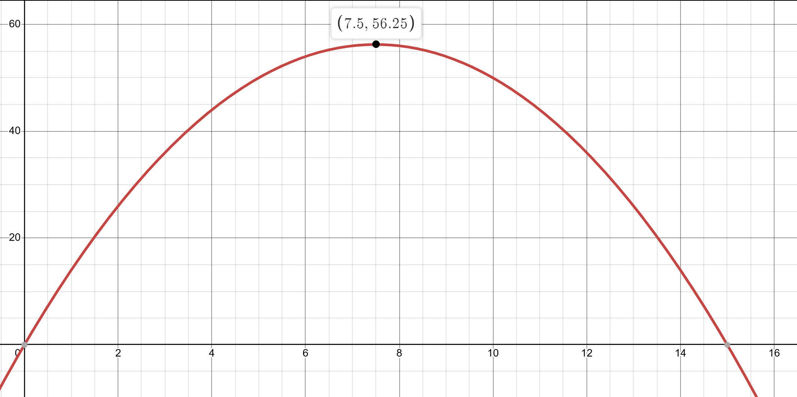

.. role:: boldblue
   :class: boldblue

.. role:: captiontext
   :class: captiontext

===========
Fenced Area
===========

Optimization is applicable in a variety of different disciplines from physics to construction. 
It can also extend to 2-D, 3-D or even higher orders of dimension. 
For this example, however, we will keep things simple and formulate an optimization problem in a 2-D space with something you might even have in your own backyard: a fence!  

You want to start a garden or contain an area for your dog to play in, but the question is how large you can make the space contained by the fence. 
It would be most beneficial to have the largest amount of space so that you can have a large garden with many types of produce or so that your dog can roam a vast space. 
However, it is unreasonable to build a fence around your entire street! 
Think about what might be a limiting factor for this project. 
Some of the most important considerations would be space, the amount of material, and cost. 
With this, you have an optimization problem, but we can phrase it in more formal terms according to what you have learned so far.

.. dropdown:: What is the objective?
   :icon: question
   
   Maximizing the area 

.. dropdown:: What are the design variables?
   :icon: question
   
   Dimensions of fence and the shape of the fence

.. dropdown:: What are the constraints?
   :icon: question
   
   Available fencing material (i.e. the perimeter), cost, and space
    
Set-up
``````
We will now look at how to set up an optimization problem and some potential methods of solving the problem. 
To keep things simple, we will only be looking at one of the three possible constraints: available fencing material.  

Here is the explicit problem: Design a rectangular fence with the largest area possible given 30 feet of fencing.  
- *Objective*: maximizing the area inside the fence
- *Design variables*: length, width of the fence (assuming a rectangular shape)
- *Constraints*: amount of material available to construct the fence

With each component of the optimization problem laid out, think about ways you could solve the problem. 
Keep in mind that there is more than one way to arrive at the solution!

.. figure:: ./images/FencedAreaFormulation1.svg
      :width: 300px
      :alt: description of the problem formulation for maximizing the area enclosed by a fence
      :align: center

      :captiontext:`Formulation for Maximizing the Area Enclosed by a Fence`

Solution 
`````````
Before beginning to solve the problem, the question should be translated into a mathematical form. 
This allows us to define the variables that are changing and set up equations that relate them to the objective and constraint functions. 
First, we will establish some notation below for the design variables and other quantities of interest. 

.. math::
  \begin{gathered}
  \textbf{Notation}\\
  l = \text{length of fence}\\
  w = \text{width of fence}\\
  A = \text{Area of fence}\\
  P = \text{Perimeter of fence}\\[1em]
  \end{gathered}

Now, using equations for the perimeter and area of a rectangle, we can relate the design variables, the length :math:`l` and the width :math:`w`, to the area objective :math:`A` and the perimeter :math:`P`.

.. math::
  \text{Constraint: Perimeter}\\
  2l + 2w = P \leq 30 \text{feet}\\[1em]
  \text{Objective: Area}\\
  A = l \cdot w\\[1em]

In this example, the inequality for the constraint represents that we have at most 30 feet of material available to construct the fence but less can also be used.  
Now, here are a few different ways to approach the problem for solution procedures. 

Sampling
````````
Using the equations above, the solution can be found by plugging in numbers for :math:`l` and :math:`w` until the largest area is found that satisfies the perimeter constraint. 
Therefore, we will pick values for the length and the width, and, using the equations from above, then calculate the perimeter and area. 
If the perimeter condition cannot be met, then the area value is not calculated, as we do not have enough material available to build that fence.
Consider two examples below for different combinations of the length and width values.

.. list-table:: 
   :widths: 50 50 50 50
   :header-rows: 1
   :class: center-table

   * - l
     - w
     - Perimeter
     - Area
   * - 2
     - 4
     - 12
     - 8
   * - 7
     - 11
     - 36
     - 

However, this method takes a long time to check all possible values of :math:`l` and :math:`w`. 
To simplify the problem, we can use intuition to assume that the largest area will use all the available fence, so the perimeter is kept constant. 
This means the perimeter is an active constraint, which leaves fewer combinations of length and width to check to determine the answer. 
Now, the length and width can only vary so that the perimeter adds up to 30 feet, and then the area can be computed from those values.

.. list-table:: 
   :widths: 50 50 50 50
   :header-rows: 1
   :class: center-table


   * - Perimeter
     - l
     - w
     - Area
   * - 30
     - 1
     - 14
     - 14
   * - 30
     - 2
     - 13
     - 26
   * - 30
     - 3
     - 12
     - 36
   * - 30
     - 4
     - 11
     - 44
   * - 30
     - 5
     - 10
     - 50
   * - 30
     - 6
     - 9
     - 54
   * - 30
     - 7
     - 8
     - 56
   * - 30
     - 8
     - 7
     - 56
   * - 30
     - 9
     - 6
     - 54

From this iterative procedure, we find that a length of 7 and a width of 8 will give us the largest area.
However, this is with the constraint that our sides are integers or whole numbers. 
If we can have the sides be fractions and add another row into the table, it is found that a length and width of 7.5 has the largest area of 56.25.
This may not seem obvious, but by looking at where the area reaches the largest value before decreasing again, it means that the correct values are at that point. 
This helps introduce the concept of derivatives in calculus for finding a critical point of a function.  

Another way of thinking about this problem is to intuit that the largest area of a rectangle will always be a square. We can change our equations to reflect this constraint. 

.. math::

   \begin{gathered}
   l = w\\
   2l + 2w = 30\\
   4l = 30\\
   l = 7.5
   \end{gathered}


Without keeping the perimeter constant and noticing that a square would have the largest area, using a trial-and-error method seems tedious, especially if we were to tackle a problem with more constraints than this. That's why some problems are being solved using an algorithm. 
An algorithm can be coded so that a computer solves each combination of values and outputs the correct answer. For this example, an algorithm could be set up such that it defines x and y variables that are the length and width and then calculate what the perimeter and area would be using known equations. It can then check if the perimeter satisfies the condition that it is less than 30. If it passes this check, it will then compare the area to the previous calculations area to see if it is greater and iterated until it closes upon the final answer. The usefulness of an algorithm comes from the fact that after one click to run the program, it can instantly find the answer you're looking for. Click on the dropdown to learn more about algorithms.

.. dropdown:: Algorithm
   :icon: light-bulb
   
   Merriam Webster defines an alogorith #ADD HYPERLINK as a procedure for solving a mathematical problem in a finite number of steps that frequently involves repetition of an operation. Commonly in computer programming an algorithm automatically does a series of steps repeatedly until it determines an answer. It can also typically be easily modified to fit a different set of constraints or design space.  

Graphically
```````````
Another approach to solving this problem is graphically and with some algebra. 
Looking at the equations formulated previously, a new equation can be formed by solving for one variable from the other. 
If you have learned how to solve a system of equations in your math classes, try this out for yourself first before seeing the answer.

.. math::

   \begin{gathered}
   2l + 2w = 30\\
   2l = 30 - 2w \\
   w = \frac{(30-2l)}{2}\\
   w = 15-l
   \end{gathered}

Now we have :math:`w` in terms of :math:`l`. 
This can then be substituted into the area equation as follows: 

.. math::

   \begin{gathered}
   l \cdot w = A\\
   (15-l)\cdot l = A\\
   15-l - l^2 = A\\
   \end{gathered}

This equation is quadratic! You may have seen it written before as :math:`ax^22 + bx + c = 0`, the same as our equation above if the variables are rearranged.
This equation can then be plotted, and the max will be at the peak of the parabola.  



      :captiontext:`Plot of the Quadratic Equation for the Fenced Area Example`

This value of the area is a global maximum, as discussed in previous sections, since there are no other values for the design variables that yield a larger objective function value.  
To visualize this relationship, try to achieve the same values using the applet below.

.. ggb:: zngqcxeb
    :width: 800
    :height: 600
    :zoom_drag: true

One additional way to solve this problem, as mentioned above, is with calculus.
If you are familiar with calculus, explore more in the dropdown below.

.. dropdown:: Calculus Based Solution
   :icon: light-bulb
   
   A derivative is the slope of the tangent line at a specific point of a function. Hence, the greater the derivative at a point, the greater the slope of the tangent line. At a critical point, the derivative is zero and taking a second derivative tells us if this point is a minimum or maximum. This is useful in optimization, since a derivative of 0 means that there is a change in slope in the function. :boldblue:`Is this really apparent from the table?` As seen in the graph, the derivative at the point where the max is would be 0 since it changes from increasing to decreasing areas.Therefore, if we know how to take the derivative of our mathematical expression for the area and set it equal to 0, we can find the point at which the area is a maximum.

   .. math::

      \begin{gathered}
      Area = 15l - l^2\\
      \frac{dA}{dl} = 15 - 2l\\
      0 = 15 - 2l\\
      l = 7.5
      \end{gathered}
   
   We have arrived at the same solution as the other methods! As we can see, taking the derivative is often a very quick and easy way to get to a maximum (or a minimum) value. It can also tell us if there is more than one point at which there is a maximum and minimum, but in this case :math:`l` just has one optimal value. 

Conclusion
``````````
Optimization is a tool that can be applied to a wide variety of problems, even those that arise in everyday life. 
In this example, we built a continuous rectangular fence and found the optimal length and width values to maximize the area inside the fence subject to a constraint on the total perimeter.
However, in real life we might want to build a fence with the house as one of the sides, so a new constraint might be having one side as constant value. 
We could also remove the assumption that the fence is rectangular, as perhaps a circle or a hexagon would allow for a greater area. 
Optimization allows us to solve for a variety of possibilities, and, by following the same methodology, one solution approach can easily be modified to modify the problem and arrive at a different solution.  
In the next section we will investigate how optimization can be applied for a physics-based application.  
