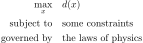

.. role:: boldblue
   :class: boldblue

.. role:: captiontext
   :class: captiontext

=========================================
Optimizing the Trajectory of a Projectile
=========================================

In this second example, consider that you are working for a nearby professional sports team, and you are tasked with improving a common timeout ritual: the T-shirt cannon launch. 
While used at many sporting events, many fans in upper sections of the stadium often do not have the opportunity to get a T-shirt because the cannon cannot launch it far enough! 
Therefore, your goal is to maximize the range that your T-shirt can travel, which is modeled with the trajectory of a projectile.

.. figure:: ./images/TrajectoryDiagram.svg
    :width: 650px
    :alt: depiction of the T-shirt cannon launch problem
    :align: center

    :captiontext:`Illustration of the T-shirt cannon launch scenario`

If you recall the process of :doc:`formulating an optimization problem <../../ingredients/formulating/formulating>`, we need to translate the real-world problem into a mathematical formulation by identifying the objective function, constraints, and design variables. 
Generally, this projectile launching problem can be formulated as shown below:

    :captiontext:`Optimization Problem Formulation for Maximizing the Distance of a Projectile`

The first line identifies the objective function :math:`d(x)`, where :math:`d` is the distance of the projectile, or the range, that we want to maximize. 
As introduced in previous sections, the :math:`(x)` after :math:`d` means that the distance the projectile travels is a function of the design variables. 
The next two lines indicate that the optimization problem has some limiting constraints and must obey the laws of physics. 
While these statements are very general, they are broadly true for all scenarios of a projectile launch. 

Now, we will add details to this generic formulation to frame the specific problem of interest. 
This is where assumptions are made about how the laws of physics affect the problem and what constraints will influence the optimization process. In this scenario, consider the following.

- Assume that the projectile is launched on a flat surface and that it eventually travels back to its initial height to reach the target point
- Air resistance, which provides aerodynamic drag that slows the object down during its flight, can be neglected
- A constraint for this problem is that the T-shirt is launched from an already designed cannon, which means that it has a fixed initial speed. While this could potentially be a design variable, it is excluded here
- Given that the speed is fixed, the design variable is the launch angle of the projectile :math:`\theta`

.. figure:: ./images/TrajectoryProblemModel.svg
    :width: 650px
    :alt: trajectory of a projectile model for the first problem scenario
    :align: center

    :captiontext:`Diagram of the trajectory of a projectile problem, where the objective is to maximize the distance of the T-shirt`

Under these assumptions, a GeoGebra applet has been constructed that models this behavior for the trajectory of a T-shirt being launched from a T-shirt cannon. 
Your goal is to find the optimal launch angle for the projectile by **adjusting the launch angle of the device**. 
As you simulate each launch, the final distance will be plotted in the second pane on the right, allowing you to keep track of your results! 
After you have finished your experiments, expand the dropdown below to see the answer.

.. ggb:: eqbugnw8
    :width: 800
    :height: 600
    :zoom_drag: false
    :full_screen_button: true

.. dropdown:: Solution
    :icon: check-circle

    For this scenario, you should have found that the optimal launch angle to maximize range is 45 degrees! 

For an additional example, revisit the assumptions made above. Given the shape of the T-shirt being launched, it is no longer valid to assume that air resistance is negligible. 
Therefore, a second applet is included below to account for this. 
Based on real-life experience, you can conclude beforehand that air resistance will decrease the maximum range that you can achieve with the projectile. 
However, pause to think about what this means for your optimum point: will the best launch angle be greater than, less than, or equal to the one identified above? 

.. ggb:: qcfta6e3
    :width: 800
    :height: 600
    :zoom_drag: false
    :full_screen_button: true

.. dropdown:: Solution 
    :icon: check-circle

    With air resistance, you should find that the optimal launch angle to maximize range is 42 degrees! As the T-shirt spends more time in the air, drag has more time to slow down its horizontal speed, decreasing the possible range. Therefore, launching at a slightly lower angle prioritizes the initial horizontal speed of the T-shirt, which ultimately allows the T-shirt to travel further than at 45 degrees. 

Now, consider a final scenario where your goal is to try and launch a T-shirt to a specific point in the stadium. 
For simplicity, assume that air resistance can be neglected. 
In this case, launching the T-shirt at the angle found above will only work if your target is in that precise location. 
Therefore, the objective is to find a launch angle that minimizes the distance to the target point. 
Consider this final applet, where the target point that you are trying to hit is shown with a red circle in the applet.

.. ggb:: vps2nx5n
    :width: 800
    :height: 600
    :zoom_drag: false
    :full_screen_button: true

.. dropdown:: Solution
    :icon: check-circle

    In this final example, you may have found that there are two potential launch angles for the T-shirt to reach the target point at about 44 and 68 degrees! This demonstrates an optimization problem where there are multiple minima, so the true optimal design point might depend on other factors that were not considered. For example, safety considerations may impose additional constraints that would prevent you from launching the T-shirt at the lower angle.

In this post, we explored a sequence of optimization problems with the goal of finding a set of optimal launch angles for a T-shirt cannon. 
This provides a preliminary introduction to simulation-based optimization. 
Here, the numerical model in the form of GeoGebra applets provides a way to perform computer experiments to determine solutions to the optimization problems. 
Simulation-based optimization is widely used within the field, particularly when the numerical models are complex and cannot be solved analytically, which provides a way to optimize systems in a variety of disciplines.

.. dropdown:: What equations were used to simulate the scenarios above?
    :icon: number

    In order to simulate the applets you explored above, a few key equations were considered. For those who are familiar with algebra and physics, you may have seen some of these concepts before! For a projectile without air resistance that is launched with an initial velocity :math:`v_0`, its horizontal position :math:`x` as a function of time :math:`t` is given by 

    .. math:: 
        x(t) = v_0 \cos(\theta) t,

    where the cosine function determines the horizontal component of the velocity. Under constant gravity :math:`g`, the vertical position :math:`y` as a function of time is computed with

    .. math::
        y(t) = v_0 \sin(\theta) t - 0.5 g t^2,

    where the sine function determines the initial velocity in the vertical direction. These equations are some of the key **kinematics equations**, which are used to describe the motion of a particle over time. If you solve for :math:`t` in terms of :math:`x` with the first equation, you can express the vertical position as a function of the horizontal position, which allows you to trace the trajectory of the projectile using its horizontal position. This equation is then expressed as

    .. math::
        y = x \tan(\theta) - \frac{g x ^2}{2 (v_0 \cos(\theta))^2},

    where :math:`y` is now computed using the initial velocity, initial angle, and any position :math:`x`!

    For the example with air resistance, the equations are a little more complex, and they vary depending on the air resistance or drag model chosen. To arrive at the simplest equations, we assumed here that the drag is directly proportional to the speed of the projectile. A full derivation of the equations of motion can be found at this `link <https://farside.ph.utexas.edu/teaching/336k/Newton/node29.html>`_, and the equations that were implemented correspond to numbers (185) and (187). Note that this reference defines the vertical position as :math:`z`, but this is just a notational choice and is equivalent to our definition for :math:`y`.